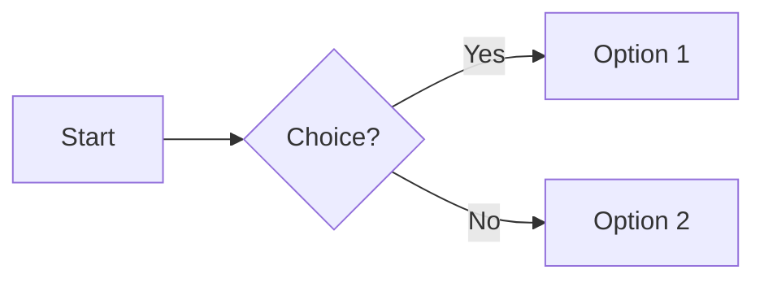

# Welcome to MkDocs

For full documentation visit [mkdocs.org](https://www.mkdocs.org).

---

## How to Add a New Page

We use **MkDocs with auto-generated navigation**. That means the folder and file
structure inside `docs/` determines the sidebar tree. You don’t need to edit
`mkdocs.yml` manually.

---

### 1. Create the Markdown File

- Inside the `docs/` folder, create a new `.md` file in the right place.
- If needed, create sub-folders to reflect how you want the navigation to look.

Example:

```text
docs/
  gameplay/
    controls.md
    combat.md
  about.md
```

This will show up in the sidebar as:

```text
Gameplay
  Controls
  Combat
About
```

---

### 2. Preview Locally

- Run the MkDocs dev server (`mkdocs serve`)
- Open <http://127.0.0.1:8000> in your browser.
- Verify the page appears in the sidebar and renders correctly.

⚠️ **Important:**
MkDocs does **not** always render Markdown exactly like GitHub or VS Code’s preview.

- **Nested lists** -> MkDocs expects **4 spaces per indent level**, while
  GitHub/VS Code allow 2.
- Always confirm in the browser, not just in VS Code.

---

### 3. Commit Your Changes

- Stage and commit the new files:

  ```bash
  git add docs/
  git commit -m "Add gameplay controls page"
  git push
  ```

---

### Tips

- Use `#` for the page title. MkDocs will automatically use the first heading as
  the page name.
- Keep file names in **snake_case** (`my_feature.md`) for consistency.
- Place images in `docs/assets/` and link with:

  ```markdown
  
  ```

---

✅ That’s it — once pushed, the new page will appear on the site automatically.

---

## Adding Images and Diagrams

Our docs support multiple ways to include visuals, depending on complexity:

---

### 1. Simple Diagrams (Mermaid)

For flowcharts, sequence diagrams, or trees, use [Mermaid](https://mermaid.js.org/).

Example:

````markdown

````

This will render directly in the docs.


---

### 2. Complex Diagrams (draw\.io)

For freestyle or detailed diagrams:

1. Create a `.drawio` file or save an existing one in `docs/drawio/`.
2. Link it in your Markdown with the `mkdocs-drawio` plugin:

```markdown

```

- The plugin will render it as an image in the page.
- You can always re-open the `.drawio` file in
  [draw.io / diagrams.net](https://app.diagrams.net/) to edit.

---

### 3. Arbitrary Images

For screenshots, concept art, or reference images:

1. Place the file in `docs/assets/`.
2. Link it with standard Markdown syntax:

```markdown

```

- Use relative paths from the page where you add the link.

---

✅ That’s it — use the right tool for the right type of image:

- **Mermaid** → simple diagrams.
- **Draw\.io** → complex, custom diagrams.
- **Assets** → any arbitrary image.
